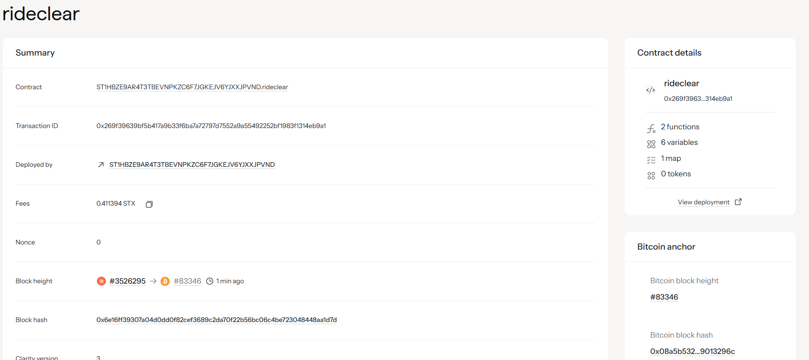

# Decentralized Ride-Sharing Platform 🚗⛓️


*Add your project banner/logo image here*

---

## 📋 Project Description

The Decentralized Ride-Sharing Platform is a blockchain-based smart contract built on the Stacks network using Clarity. This project eliminates intermediaries in ride-sharing by providing a trustless, transparent platform where passengers and drivers can interact directly. The contract handles escrow payments automatically, ensuring both parties are protected during transactions.

### 🔑 Key Features
- **Escrow System**: Passenger funds are held in the contract until ride completion
- **Transparent Operations**: All ride requests and completions are recorded on-chain
- **Direct P2P Interaction**: No centralized authority controlling transactions
- **Automated Payments**: Smart contract releases payment upon ride completion


---

## 🎯 Project Vision

Our vision is to revolutionize the ride-sharing industry by creating a decentralized ecosystem that:

- **🔓 Empowers Users**: Gives control back to passengers and drivers by removing centralized platforms
- **💰 Reduces Costs**: Eliminates platform fees and intermediary charges
- **🔍 Ensures Transparency**: All transactions are publicly verifiable on the blockchain
- **🤝 Builds Trust**: Smart contract automation ensures fair and secure transactions
- **🚀 Promotes Innovation**: Provides a foundation for community-driven ride-sharing solutions

We envision a future where transportation services operate on decentralized protocols, fostering innovation, reducing costs, and creating more equitable opportunities for all participants in the sharing economy.

---

## 🔮 Future Scope


### Phase 2 Enhancements
- **⭐ Rating System**: Implement driver and passenger rating mechanisms
- **⚖️ Dispute Resolution**: Add automated dispute handling and resolution protocols
- **📈 Dynamic Pricing**: Integrate time-based and demand-based fare calculations
- **🪙 Multi-token Support**: Accept various cryptocurrencies for payments

### Phase 3 Expansions
- **📍 GPS Integration**: Connect with decentralized location services
- **🛡️ Insurance Protocol**: Implement on-chain insurance for rides
- **🗳️ Governance Token**: Launch platform governance token for community decision-making
- **🌐 Cross-chain Compatibility**: Expand to multiple blockchain networks

### Long-term Goals
- **📱 Mobile DApp**: Develop user-friendly mobile applications
- **📊 Driver Analytics**: Provide earnings and performance analytics
- **🚐 Fleet Management**: Support for vehicle fleet operators
- **🔌 Integration APIs**: Enable third-party integrations and services

---

## 🛠️ Technical Implementation


The smart contract consists of two core functions:

1. **`request-ride`**: Allows passengers to request rides and escrow payment
2. **`complete-ride`**: Enables passengers to complete rides and trigger driver payment

The contract uses STX (Stacks native token) for payments and maintains ride state through blockchain storage.

### Contract Functions Overview

```clarity
;; Main Functions
(define-public (request-ride (driver principal) (fare uint)))
(define-public (complete-ride (ride-id uint)))

;; Read-only Functions
(define-read-only (get-ride-info (ride-id uint)))
(define-read-only (get-next-ride-id))
```

---

## 📝 Contract Address Details

### 🧪 Testnet Deployment


- **Network**: Stacks Testnet
- **Contract Name**: `rideshare`
- **Contract Address**: `[To be added after deployment]`
- **Transaction Hash**: `[To be added after deployment]`
- **Explorer Link**: `[To be added after deployment]`

### 🚀 Mainnet Deployment


- **Network**: Stacks Mainnet
- **Contract Name**: `rideshare`
- **Contract Address**: `[To be added after mainnet deployment]`
- **Transaction Hash**: `[To be added after mainnet deployment]`
- **Explorer Link**: `[To be added after mainnet deployment]`

---

## 🚀 Getting Started


*Visual setup guide*

### Prerequisites
- Node.js and npm
- Clarinet CLI tool
- Stacks wallet (Hiro Wallet or Leather Wallet recommended)

### Local Development
```bash
# Clone the repository
git clone <repository-url>
cd rideshare-platform

# Install Clarinet (if not already installed)
npm install -g @hirosystems/clarinet-cli

# Run local tests
clarinet test

# Check contract syntax
clarinet check

# Deploy to testnet
clarinet deploy --testnet
```

### Usage Examples


#### Requesting a Ride
```clarity
(contract-call? .rideshare request-ride 'SP2DRIVER123... u1000000)
```

#### Completing a Ride
```clarity
(contract-call? .rideshare complete-ride u1)
```

---

## 📊 Project Statistics


| Metric | Value |
|--------|-------|
| Total Rides | `[To be updated]` |
| Active Users | `[To be updated]` |
| Total Volume | `[To be updated] STX` |
| Success Rate | `[To be updated]%` |

---

## 🤝 Contributing


*How to contribute to the project*

We welcome contributions from the community! Here's how you can help:

1. **Fork the repository**
2. **Create a feature branch** (`git checkout -b feature/amazing-feature`)
3. **Commit your changes** (`git commit -m 'Add amazing feature'`)
4. **Push to the branch** (`git push origin feature/amazing-feature`)
5. **Open a Pull Request**

### Development Guidelines
- Follow Clarity best practices
- Add tests for new features
- Update documentation
- Ensure code passes all checks

---

## 📄 License

This project is licensed under the MIT License - see the [LICENSE](LICENSE) file for details.

---


---

## 🙏 Acknowledgments

- Built on [Stacks Blockchain](https://stacks.co/)
- Developed with [Clarinet](https://github.com/hirosystems/clarinet)
- Inspired by the decentralized web movement

---

*Made with ❤️ for the decentralized future*
